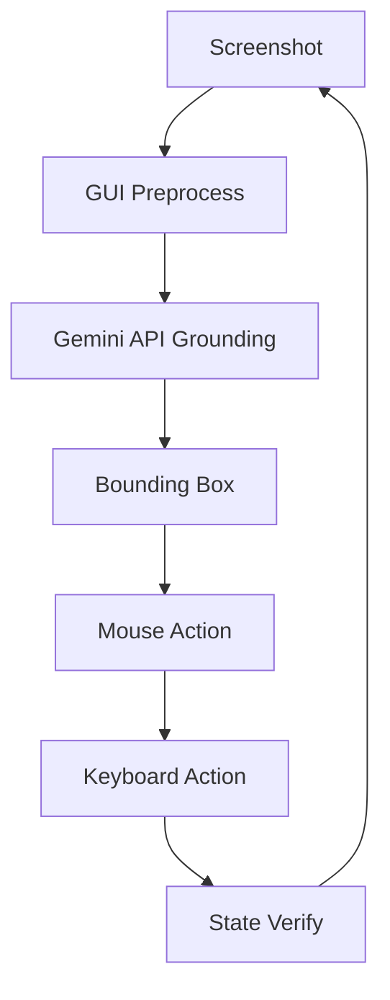

# ScreenSeekeR Notepad Automation

Windows desktop automation using **Google Gemini** for visual grounding — locate GUI elements from natural language without hardcoded coordinates, template matching, or local GPU model downloads.

## Architecture



## Requirements

- Windows 10/11, 1920×1080 (100% scaling recommended)
- Python 3.12+
- [uv](https://docs.astral.sh/uv/) package manager
- **Gemini API key** ([get one free](https://aistudio.google.com/apikey))
- Internet connection (API calls — no local model download)

## Installation

```powershell
cd ai-notepad-automation

# Install uv (PowerShell)
powershell -ExecutionPolicy ByPass -c "irm https://astral.sh/uv/install.ps1 | iex"

# Install dependencies
uv sync --extra dev

# Set your API key (google-genai SDK accepts either name)
set GOOGLE_API_KEY=your_key_here
```

Or copy `.env.example` to `.env` and fill in your key (load manually or use `set` in the shell).

## Usage

### Setup desktop

```powershell
uv run python main.py setup
```

### Demo grounding (single screenshot — best first test)

```powershell
set GOOGLE_API_KEY=your_key_here
uv run python main.py demo --profile high
```

### Run full pipeline (10 posts)

```powershell
uv run python main.py run --profile high
```

Each iteration: fresh screenshot → Gemini finds Notepad icon → double-click → type → save to `Desktop\tjm-project\post_{id}.txt` → close → repeat.

### Annotated screenshots

```powershell
uv run python main.py annotate --profile high
```

### Mock mode (no API key)

```powershell
uv run python main.py demo --mock
uv run python main.py run --mock
```

## Profiles

| Profile | Gemini model | Use case |
|---------|--------------|----------|
| `high` | `gemini-2.0-flash` | Best accuracy (default) |
| `low` | `gemini-2.0-flash-lite` | Faster / cheaper |

Configure in `config/profile_high.yaml` and `config/profile_low.yaml`.

## Configuration

| File | Purpose |
|------|---------|
| `config/default.yaml` | Shared settings, Gemini defaults |
| `config/profile_high.yaml` | Flash model |
| `config/profile_low.yaml` | Flash-Lite model |

Key settings:
- `grounding.icon_instruction` — what to find on screen
- `gemini.min_confidence` — reject low-confidence detections
- `gemini.api_key_env` — env var name for API key (default: `GOOGLE_API_KEY`)

## Folder Structure

```
├── main.py                 # CLI entry
├── vision/
│   ├── genai_client.py     # google-genai SDK client factory
│   ├── gemini_grounding.py # Structured grounding via GenAI
│   └── gui_parser.py       # Coordinates + annotation
├── automation/             # Mouse, keyboard, screenshots
├── core/pipeline.py        # Full workflow
└── config/                 # YAML settings
```

Legacy local-model files (`screenseeker.py`, `planner.py`, OS-Atlas in `grounding.py`) are kept for reference but **not used** by the default pipeline.

## Testing

```powershell
uv run pytest tests/ -v
```

## Documentation

- [Design Document](docs/DESIGN.md)
- [Interview Preparation](docs/INTERVIEW_PREP.md)

## Known Limitations

- Requires internet and a valid Gemini API key
- API usage may incur Google Cloud charges at scale
- Windows-only at runtime for mouse/keyboard automation
- 100% DPI scaling strongly recommended
