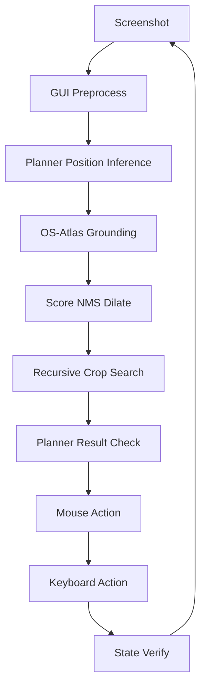

# ScreenSeekeR Notepad Automation

Windows desktop automation using the **ScreenSeekeR** agentic visual grounding pipeline from [ScreenSpot-Pro (arXiv:2504.07981)](https://arxiv.org/pdf/2504.07981). Locates GUI elements via natural language — no hardcoded coordinates, template matching, or OCR-only detection.

## Architecture



## Requirements

- Windows 10/11, 1920×1080 (100% scaling recommended)
- Python 3.12+
- [uv](https://docs.astral.sh/uv/) package manager
- NVIDIA GPU recommended (8 GB+ VRAM for low profile, 16 GB+ for high)

## Installation

```bash
# Clone and enter project
cd ai-notepad-automation

# Install uv (if needed)
# curl -LsSf https://astral.sh/uv/install.sh | sh

# Install dependencies + vision extras
uv sync --extra vision --extra dev
```

Models download automatically from HuggingFace on first run:
- **High profile:** `OS-Copilot/OS-Atlas-Base-7B` + `Qwen/Qwen2.5-VL-7B-Instruct`
- **Low profile:** `OS-Copilot/OS-Atlas-Base-4B` + `Qwen/Qwen2.5-VL-3B-Instruct` (4-bit)

Set cache directory (optional):
```bash
set HF_HOME=models
```

## Usage

### Setup desktop

```bash
uv run python main.py setup
```

Creates `Desktop/tjm-project/` and ensures a Notepad shortcut exists.

### Run full pipeline (10 posts)

```bash
uv run python main.py run --profile high
# or for lower-spec machines:
uv run python main.py run --profile low
```

Each iteration:
1. Fresh screenshot
2. ScreenSeekeR grounds the Notepad desktop icon
3. Double-clicks, types post, saves to `Desktop/tjm-project/post_{id}.txt`
4. Closes Notepad and repeats

### Demo grounding (single shot)

```bash
uv run python main.py demo --instruction "Notepad desktop icon"
```

### Generate annotated screenshots

Arrange the Notepad icon at three positions (top-left, center, bottom-right), then:

```bash
uv run python main.py annotate --profile high
```

Output: `screenshots/annotated/notepad_{position}.png`

### Mock mode (no GPU)

```bash
uv run python main.py run --mock
uv run python main.py annotate --mock
```

## Folder Structure

```
├── main.py                 # CLI entry
├── config/                 # YAML configuration + profiles
├── vision/                 # ScreenSeekeR, OS-Atlas, planner, GUI parser
├── automation/             # Mouse, keyboard, Windows capture
├── api/                    # JSONPlaceholder client
├── core/                   # Pipeline, config, retry, logging
├── scripts/                # Desktop setup, annotated screenshot generator
├── models/                 # HuggingFace cache (runtime)
├── screenshots/            # Logs, failures, annotated output
├── tests/                  # Unit tests
└── docs/                   # Design doc, interview prep
```

## Configuration

| File | Purpose |
|------|---------|
| `config/default.yaml` | Shared defaults |
| `config/profile_high.yaml` | 7B models, full ScreenSeekeR |
| `config/profile_low.yaml` | 4B/3B INT4, ReGround fallback |

Key settings: `grounding.icon_instruction`, confidence thresholds, retry counts, timeouts.

## Known Limitations

- **Windows only** at runtime (development possible on macOS/Linux for tests).
- **High VRAM** required for 7B models without quantization.
- **English UI** recommended for Save-As keyboard flow.
- **100% DPI scaling** strongly recommended; non-100% may cause coordinate drift.
- **First run** downloads multi-GB models (requires internet).
- Planner is Qwen2.5-VL (open-source) instead of paper's GPT-4o — documented deviation.

## Testing

```bash
uv run pytest tests/ -v
```

## Documentation

- [Design Document](docs/DESIGN.md)
- [Interview Preparation](docs/INTERVIEW_PREP.md)

## License

MIT (assignment project)
